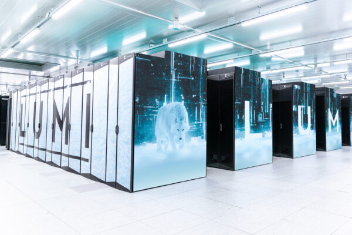

# Utilizing supercomputers for remote sensing data processing and analysis {.title}

Samantha Wittke, CSC (Geoinformatics specialist)

# Outline

1. Motivation
2. Supercomputers
3. CSC
4. Support
5. Where to go from here

# 1. Motivation

Task: Calculate 10 vegetation indices of timeseries of whole Finland

 

* 
Sentinel-2 ~60 tiles x ~30 timepoints per year

* 
preprocessing + index calculations per tile : 20 min, 8 GB, 1 core

* 
60x30x20min = 36000 min = 25 days sequential processing

* 
on supercomputer: ~few hours

  

# 1.1 Why use a supercomputer?

&#8987; Resource needs (time, memory, storage, GPU)

&#128126; “Outsource” heavy computations, keep own computer free

&#127960; Prebuilt environments, application availability

&#128202; Run many experiments at same time

&#127760; Data availability

&#128101; Collaboration possibility

&#10067; CSC specialist support

&#128184; Free of charge for open science at Finnish universities and research institutes.

# 2. Supercomputers

   

<b>Puhti - Mahti - LUMI</b>

# 2.1 Puhti

  

 

* Use cases from interactive single core data processing to medium scale parallel simulations
* `~28 000` Intel CPUs 
* `240` Nvidia V100 GPUs 
* wide stack of pre-installed software

# 2.1.1 Puhti webinterface 

&rarr; check your data, testing, code development, file management, quotas, apps

[`https://puhti.csc.fi`](https://puhti.csc.fi)

  

# 2.1.2 Puhti applications

* Ames stereo pipeline
* CloudCompare
* FORCE 
* GDAL/OGR
* GRASS GIS
* Julia
* LasTools
* MatLab 
* OpenDroneMap
* Orfeo Toolbox
* PCL

* PDAL
* Python geospatial packages: geoconda
* QGIS
* R geospatial packages: r-env
* SagaGIS
* SNAP, Sen2cor, sen2mosaic
* WhiteboxTools
* Zonation
* Deep learning: pytorch, tensorflow

<b>Something missing? &rarr; Ask us :) </b>

# 2.1.3 Data available on Puhti

* Large commonly used geospatial datasets with open license
* Removes transfer bottleneck
* Located at: `/appl/data/geo/`
* All Puhti users have read access

* ~13 TB of datasets available:
  * Paituli data 
  * SYKE open datasets
  * LUKE Multi-source national forest inventory
  * Virtual rasters for NLS DEMs
  * Sentinel and Landsat mosaics

 

[List of spatial data in computing environment](https://docs.csc.fi/data/datasets/spatial-data-in-csc-computing-env/)

# 2.2 Mahti

  

 

* Geared towards medium and large scale parallel simulations
* `~90 000` Intel CPUs
* `96` Nvidia A100 GPUs 
* some pre-installed software

# 2.3 LUMI

  

 

* Research + industry and SME access
* `~100 000`  AMD EPYK CPUs
* `~10 000` AMD MI250X GPUs
* Some pre-installed software

# 2.4 Harnessing the power

Supercomputer != laptop

 

[CSC environment self learn course](https://ssl.eventilla.com/csccompenvselearn)

 

[Workflow recommendations, High Throughput Computing](https://docs.csc./computing/running/throughput/)

 

[Machine learning guide](https://docs.csc.fi/support/tutorials/ml-guide/) 

# 3. CSC - IT center for science

* Non-profit company producing IT services for research and higher education
* Owned by ministry of education and culture (70%) and higher education institutions (30%)
* Headquaters in Keilaniemi, Espoo
* Side offices and supercomputers in Kajaani

  

# 3.1 CSC services

[`research.csc.fi/en/service-catalog`](https://research.csc.fi/en/service-catalog)

  

**Compute & Analyze**

* 
 Webservices, virtual machines in the cloud: `cPouta / ePouta / Rahti` 

* 
 Heavy computations on the supercomputer: `Puhti / Mahti / LUMI` 

* 
 Teaching and collaborating: `CSC Notebooks` 

**Store, Share & Publish Data**

* 
 Project lifetime data storage: `Allas` 

* 
 Share and publish data: `Fairdata`

* 
 Share and publish geospatial data: `Paituli`

 

Working with privacy related data: `Sensitive Data (SD) services`

# 4. Support

[`docs.csc.fi`](https://docs.csc.fi)

[`research.csc.fi`](https://research.csc.fi)

 

\+ servicedesk@csc.fi

\+ User support session in Zoom every Wednesday at 14.00

# 4.1 How we can help

  

<b>&rarr; servicedesk@csc.fi</b>
 

  

<b>&rarr;CSC as project partner / subcontractor</b>
 

# 5. Where to go from here?

* Create an account and project
* Choose suitable service for your task
  * Contact `servicedesk@csc.fi` if unsure
* Learn about the service
  * [`docs.csc.fi`](https://docs.csc.fi)
  * [Geocomputing at CSC resources](https://research.csc.fi/geocomputing)                                                           
  * [Examples in github](https://github.com/csc-training/geocomputing)
  * [Visit courses, webinars, workshops](https://www.csc.fi/en/training)
* Ask for help, if needed, we don't bite :)

# Thank you for your attention! 

 

Questions? &rarr; ask now or contact `servicedesk@csc.fi` 

 

  

  

