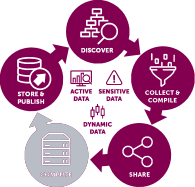
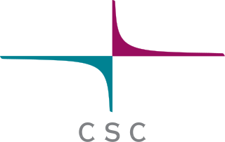

# CSC computing resources {.title}

Samantha Wittke, CSC (Geoinformatics specialist),  
Geospatial challengecamp kickoff 25.09.23  

# Outline

1. CSC
2. Computing 
3. Data
4. Learning and support
5. Where to go from here?

# CSC

* Non-profit company producing IT services for research and higher education
* Owned by ministry of education and culture (70%) and higher education institutions (30%)
* Headquaters in Keilaniemi, Espoo

* Currently ~660 employees

 

  
  Kajaani side office and supercomputers

# Computing services for research

  

* Collaborate
* Scale up your computation
* Work in the cloud
* Comfortable computing environments

  

# Computing services for industry - LUMI

 

  

 

* Funded by EuroHPCJU 
* Hosted by LUMI consortium countries
* Research + SME access
* `~100 000`  AMD EPYK CPUs
* `~10 000` AMD MI250X GPUs
* Some pre-installed software
* Support in Finland via CSC

# Data

* Various storage options
* Share data with collaborators
  

* Spatial data download service: `Paituli.csc.fi`
* Spatio Temporal Asset Catalog (STAC)

  

# Learning and support

 

* Documentation / tutorials 
* Examples 
* Workshops / courses
* Specialist support
* Weekly user support session

 

&rarr; `docs.csc.fi`

&rarr; `github.com/csc-training/geocomputing` 

&rarr; `csc.fi/training` 

&rarr; `servicedesk@csc.fi` 

&rarr; `ssl.eventilla.com/usersupportcoffee` 

# Thank you for your attention! 

Where to go from here?

* Longer talk tomorrow
* Geocomputing course 12.+13. October 
* Questions? &rarr; `servicedesk@csc.fi`

 

  

  

  

