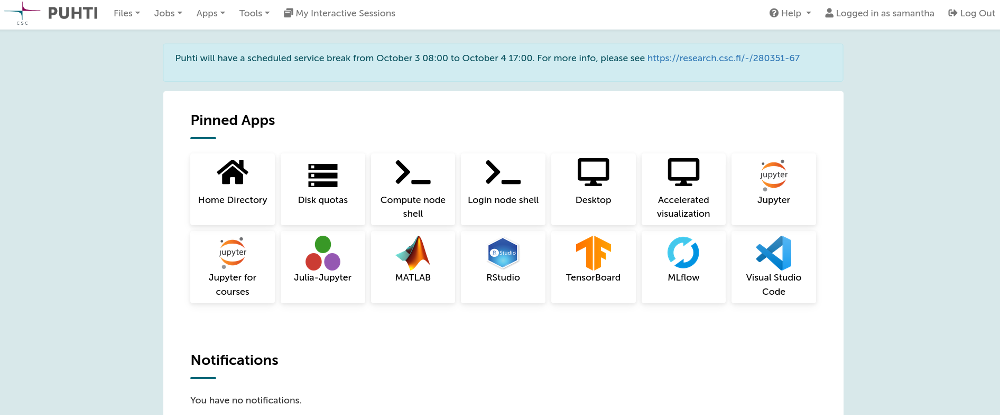
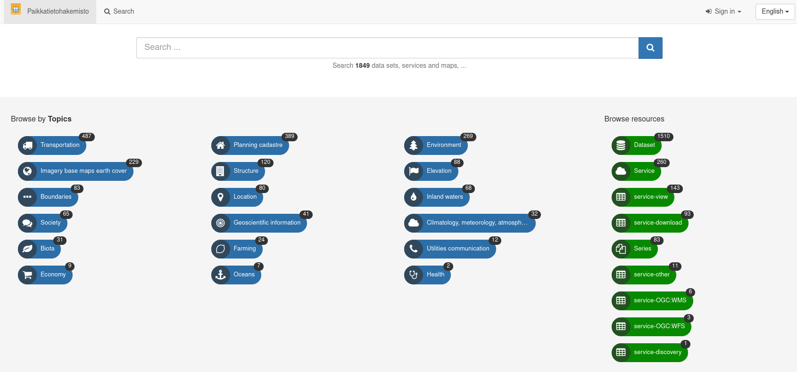
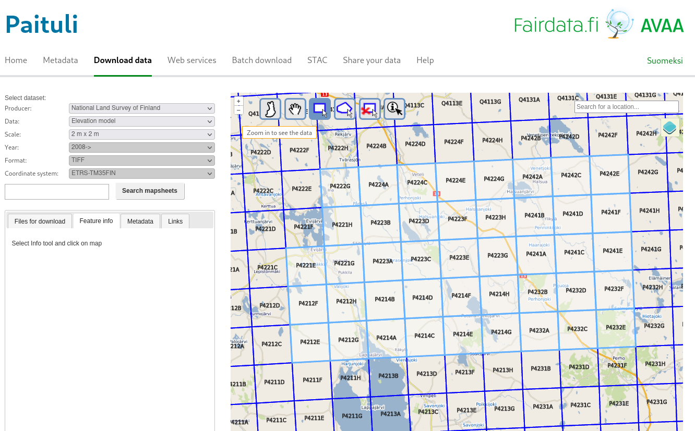
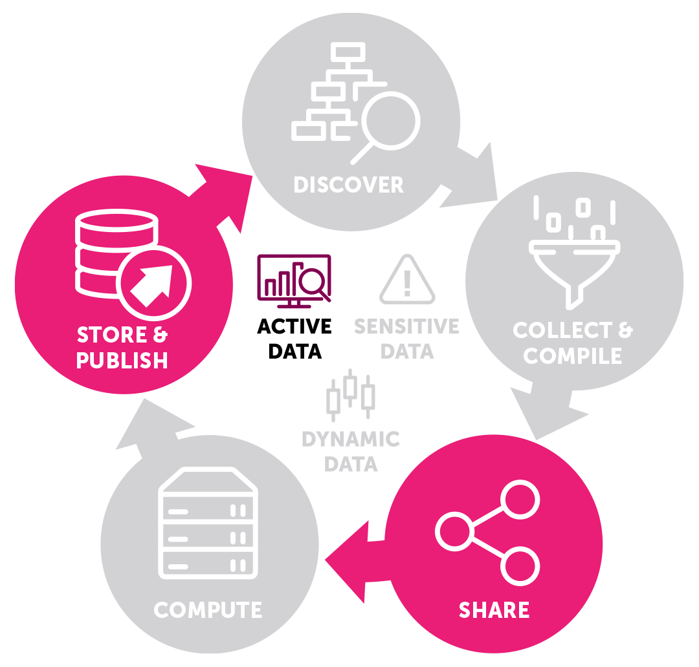
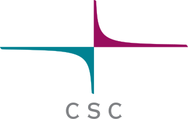
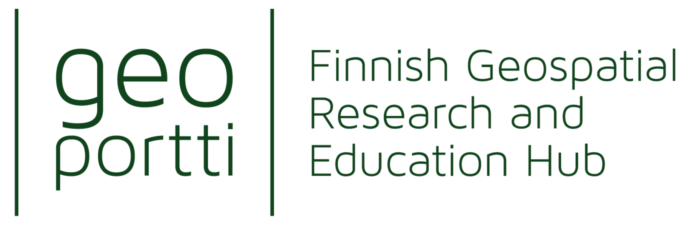
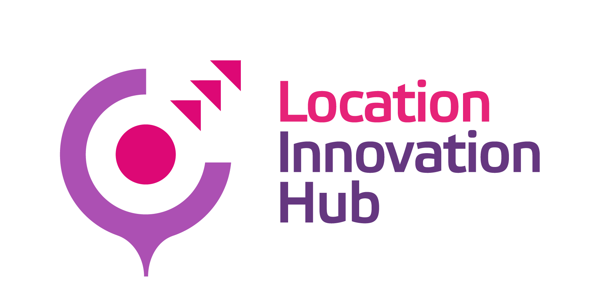

# Overview of CSC computational resources for research {.title}

Samantha Wittke, CSC (Research Software Engineer),  Geospatial challengecamp kickoff February 2025  

# Outline

1. CSC services for research overview
2. Puhti- a supercomputer
3. Data
4. Training and support
5. Mentoring

# CSC services for research

**Compute & Analyze**
  
* Supercomputers for fast and large simulations, data analysis and more: 
    * [Puhti](https://research.csc.fi/-/puhti) - a good starting point, large collection of pre-installed software, national 
    * [Mahti](https://research.csc.fi/-/mahti), national
    * [LUMI](https://www.lumi-supercomputer.eu/) , owned by the European High-Performance Computing Joint Undertaking (EuroHPC JU), hosted in Finland
* Virtual machines for web services and database: [cPouta](https://research.csc.fi/-/cpouta)
* Container cloud for scalable web services : [Rahti](https://research.csc.fi/-/rahti)
* Sensitive data: [SD services](https://research.csc.fi/sensitive-data-services-for-research), [ePouta](https://research.csc.fi/-/epouta)
* Quantum learning machine: [Kvasi](https://research.csc.fi/-/kvasi)

#  CSC services for research 

**Store, Share & Publish Data**
* [CSC Data Management main page](https://research.csc.fi/data-management) and [video playlist](https://www.youtube.com/watch?v=K-kEvfaUJdA&list=PLD5XtevzF3yEZw-8LadtaGVV8Um6CbMja) 
* Project lifetime data storage: [Allas](https://research.csc.fi/-/allas)
* Databases: [Pukki](https://docs.csc.fi/cloud/dbaas/) ([Kaivos](https://research.csc.fi/-/kaivos))
* Publishing (with access management), storing or finding data according to FAIR (Findable Accessible Interoperable Reusable) principles: [OKM Fairdata](https://www.fairdata.fi/en/): 
    * IDA: Store your data 
    * Etsin: Find data
    * Qvain: Describe your data
    * PAS: Preserve your data
* Sending data: [Funet FileSender](https://filesender.funet.fi/)
* Sensitive data: [SD services](https://research.csc.fi/sensitive-data-services-for-research)
* [Research information hub](https://research.fi/en/)

# Why use CSC services?

* CSC specialist support
* Limited resources on own computer
* “Outsource” heavy/specialized computations
* Easier collaboration
* **Free of charge** for open science at Finnish universities and research institutes

# Why use a supercomputer?

&#8987; Resource needs (time, memory, storage, GPU)

&#128126; “Outsource” heavier computations, keep own computer free

&#127960; Prebuilt environments, application availability

&#128202; Run many experiments at same time

&#128101; Collaboration possibility

&#10067; CSC specialist support

&#128184; Free of charge for you.

# Supercomputers

# Puhti webinterface 

&rarr; check your data, testing, code development, file management, quotas, apps

[`https://puhti.csc.fi`](https://puhti.csc.fi)

  

# Puhti applications

* CloudCompare
* FORCE 
* GDAL/OGR
* GRASS GIS
* Julia
* LasTools
* MatLab 
* OpenDroneMap
* Orfeo Toolbox
* PCL
* PDAL

* Python geospatial packages: geoconda
* QGIS
* R geospatial packages: r-env
* SagaGIS
* SNAP, Sen2cor, sen2mosaic
* WhiteboxTools
* Zonation
* Deep learning: pytorch, tensorflow

<b>Something missing? &rarr; Ask us :) </b>

# Data available on Puhti

* Large commonly used geospatial datasets with open license
* Removes transfer bottleneck
* Located at: `/appl/data/geo/`
* All Puhti users have read access

* ~13 TB of datasets available:
  * Paituli data 
  * SYKE open datasets
  * LUKE Multi-source national forest inventory
  * NLS Virtual rasters for DEMs
  * Sentinel and Landsat mosaics

 

[List of spatial data in computing environment](https://docs.csc.fi/data/datasets/spatial-data-in-csc-computing-env/)

# Skills

"`You can’t learn everything you need all at once.
Instead, continually learn and know when to ask for help.`"
  - Aalto Scientific Computing

 

* 
Linux and commandline

* 
Get to know new system and concepts

* 
Possibly new software / ways of working

* 
Data transfer 

* 
...

# Harnessing the power

Supercomputer != laptop

  

&rarr; [CSC computing environment self-learning course](https://csc.fi/en/training-calendar/csc-computing-environment-self-learning/)

# Data - Acquisition

Non-CSC services: 
 

* `paikkatietohakemisto.fi`
* `avoindata.fi`
* Statistics Finland paikkatietoainesto

  

# Data - Acquisition

 

FAIRDATA services  
&rarr; Paituli spatial data download service 
`paituli.csc.fi`

  

# Data - Storage

* On disk for frequent use  

* Object storage Allas
  * Data gateway to CSC environment
  * Up to 200TB for free
  * Project lifetime storage
  * Some tools support direct read from Allas
  * NOT a file system, data management environment, backup service

  

# Training

* ['CSC computing environment' self-study course](https://csc.fi/en/training-calendar/csc-computing-environment-self-learning/)
* ['Research data management' self-study course](https://csc.fi/en/training-calendar/cscs-self-study-research-data-management-course/)
* [CodeRefinery workshop; collaborating on research coding projects and making your code more reusable](https://coderefinery.github.io/2025-03-25-workshop/); [materials](https://coderefinery.org/lessons/core/)
* [CSC geoinformatics training materials](https://docs.csc.fi/support/training-material/#geoscience)

  
&rarr; follow our [training calendar](https://www.csc.fi/en/training#training-calendar)

# Support

[`docs.csc.fi`](https://docs.csc.fi)

[`research.csc.fi`](https://research.csc.fi)

[`github.com/csc-training/geocomputing`](https://github.com/csc-training/geocomputing)

 

\+ servicedesk@csc.fi

\+ [General user support sessions](https://csc.fi/en/training-calendar/csc-research-support-coffee-every-wednesday-at-1400-finnish-time-2-2/) in Zoom every Wednesday at 14.00

# Mentoring

 

Email to:   

servicedesk@csc.fi 
CC: samantha.wittke@csc.fi
Subject: mention Geospatial Challenge Camp or GCC

 

We are happy to offer mentoring sessions:   

* Technical level
* Service and tools choice

# Thank you for your attention! 

 

Questions? &rarr; ask now or contact `servicedesk@csc.fi` 

 

  

  

  

